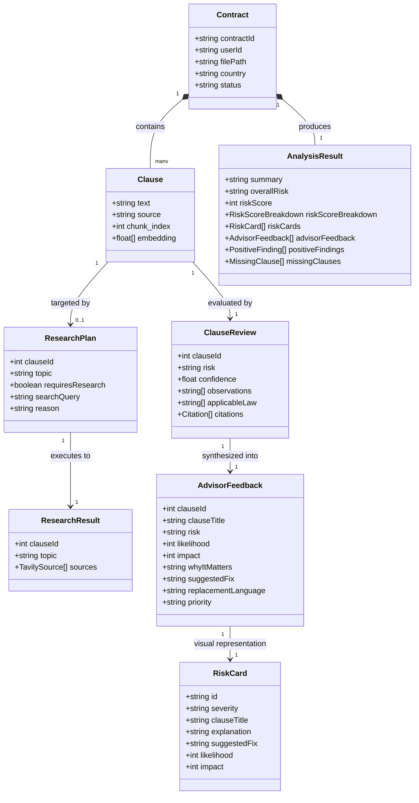

# LegalGPT — Domain Model Specification

This document details the core domain entities, data structures, and relationships powering LegalGPT's AI contract analysis and RAG chat system.

---

## 1. Domain Entity Relationship Diagram

---

## 2. Core Domain Models

### 2.1. Ingestion & Preprocessing

- **`Clause`**: A discrete, coherent legal provision extracted from the uploaded document with its sequential `chunk_index` and `source` breadcrumb.
- **`AnalysisState`**: The LangGraph graph state tracking raw text, cleaned text, vector embeddings, research intermediate results, reviewer feedback, and final advisory output.

---

### 2.2. Autonomous Research & Verification

- **`ResearchPlan`**: Formulated by the `planResearchNode` to determine which clauses require external statutory/case-law verification and generates targeted search queries.
- **`TavilySource`**: Web search snippet containing `title`, `url`, and extracted legal snippet `content`.
- **`VerifiedEvidence`**: Synthesized factual validation with confidence scores and authority citations.

---

### 2.3. Legal Advisory & Risk Assessment

- **`ClauseReview`**: Detailed legal findings generated by `legalReviewerNode`, detailing observations, applicable statutes, and risk factors.
- **`AdvisorFeedback`**: Executive-level actionable advice from `legalAdvisorNode`, providing:
  - **`risk`**: Risk level (`LOW`, `MEDIUM`, `HIGH`, `CRITICAL`).
  - **`likelihood` & `impact`**: Numerical ratings on a 1–5 scale.
  - **`whyItMatters`**: Business and operational impact explanation.
  - **`replacementLanguage`**: Ready-to-use substitute clause language.
- **`RiskCard`**: UI-optimized data model representing high-priority risk areas.
- **`MissingClause`**: Standard protective clauses absent from the agreement (e.g., Limitation of Liability, Dispute Resolution, Indemnification).
- **`PositiveFinding`**: Favorable terms that protect the client's interests.
- **`RiskScoreBreakdown`**: 0–100 category scores across `contractQuality`, `clauseRisk`, and `jurisdictionCompliance`.

---

### 2.4. Conversational RAG Domain

- **`ChatState`**: Graph state for conversational contract queries containing `contractId`, `messages`, `analysisSummary`, `retrievedContext`, and execution `status`.
- **`ChatMessageItem`**: Conversational turn with role (`user`, `assistant`, `system`), text content, timestamp, and optional citation references.
