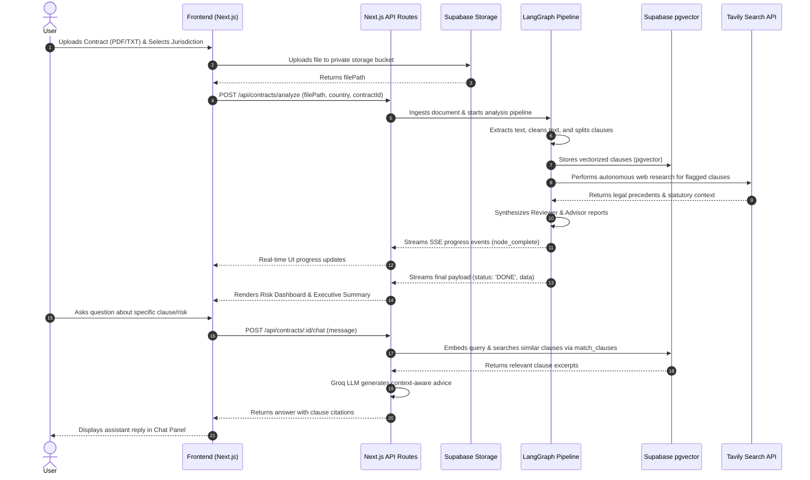

# LegalGPT — User Journey & Application Flow

This document maps out the end-to-end user experience and interaction lifecycle within LegalGPT.

---

## 1. High-Level Flow Diagram

---

## 2. Detailed Interaction Steps

### Step 1: Upload & Configuration
1. User navigates to the application and accesses the **Contract Ingestion** interface.
2. User uploads a contract document (PDF, TXT, or pasted raw text).
3. User selects the governing **Jurisdiction/Country** (e.g., *United States*, *India*, *United Kingdom*) to tailor regulatory checks.
4. Client uploads the binary to Supabase Storage and receives the storage `filePath`.

---

### Step 2: Live Pipeline Execution & Real-Time Feedback
1. The frontend initiates an SSE connection via `useContractAnalysis()` to `/api/contracts/analyze`.
2. The user sees a live stepper tracking progression through the 9 LangGraph pipeline nodes:
   - `text-extract-node`
   - `text-clean-node`
   - `clause-split-node`
   - `contract-embed-node`
   - `flag-imp-clauses-node`
   - `plan-research-node`
   - `execute-research-node`
   - `legal-reviewer-node`
   - `legal-advisor-node`
3. Completed nodes are marked with checkmarks and elapsed timing indicators.

---

### Step 3: Executive Risk Dashboard
Once analysis completes (`status: 'DONE'`), the user is presented with the structured executive report:
- **Overall Risk Gauge**: High/Medium/Low badge with numerical risk score (0–100).
- **Score Breakdown**: Sub-scores for *Contract Quality*, *Clause Risk*, and *Jurisdiction Compliance*.
- **Risk Cards**: Expandable cards highlighting high-risk clauses, business implications (*Why It Matters*), and proposed substitute text (*Replacement Language*).
- **Positive Findings**: Notable clauses that adequately protect the client.
- **Missing Provisions**: Critical omitted clauses (e.g. indemnity, liability caps, dispute resolution).

---

### Step 4: Context-Aware RAG Legal Chat
1. User opens the **Ask LegalGPT** chat drawer.
2. User can select suggested prompts (e.g., *"Summarize my obligations"*, *"What should I negotiate?"*, *"Is this enforceable?"*) or type custom questions.
3. The RAG pipeline performs vector similarity retrieval against stored clause embeddings and provides instant, legally reasoned answers grounded directly in the contract text.
